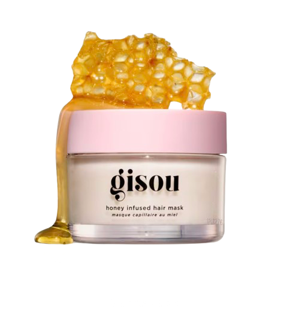

# 🧴 Velvet Skin & Co.

Welcome to **Velvet Skin & Co.**, a sleek and elegant front-end project for a skincare and cosmetics shopping website. Built with ❤️ using HTML, CSS, Bootstrap 4, and Vanilla JavaScript.


---

## 🌟 Features

- 🛍️ Product carousel for top skincare highlights
- 🧴 Multiple product sections: Face Care, Body & Hair Care
- 🛒 Add to Cart functionality using `localStorage`
- 📦 Cart page redirection from "Buy Now"
- 📱 Fully responsive using Bootstrap 4
- 💄 Beautiful product card layout with smooth image scaling
- 🧭 Navbar with navigation to Home, About, Contact & Cart
- ✨ Google Fonts and FontAwesome icons for a modern UI

---

## 🖼️ Screenshots

| Home Carousel | Face Care Grid | Body & Hair Care |
|---------------|----------------|------------------|
|  |  |  |

---

## 🔧 Tech Stack

- **HTML5**
- **CSS3**
- **Bootstrap 4**
- **JavaScript (Vanilla)**
- **FontAwesome**
- **Google Fonts**
- **LocalStorage API**

---

## 🚀 Getting Started

### 1. Clone the Repository
```bash
git clone https://github.com/yourusername/velvet-skin-co.git
cd velvet-skin-co
