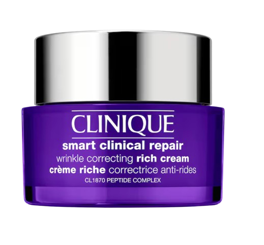
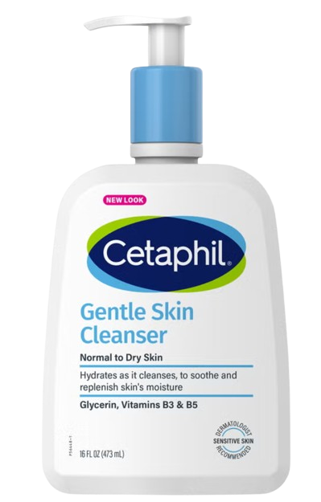
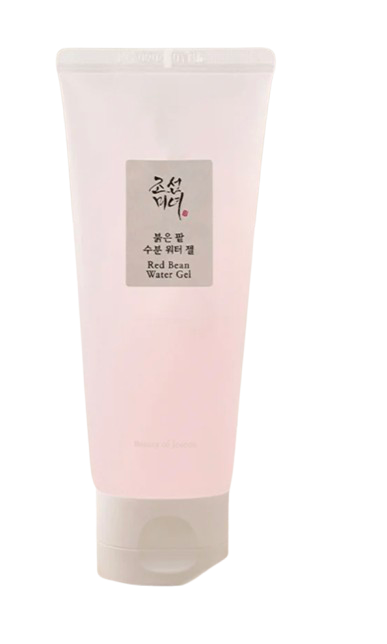

<h1 align="center">✨ Velvet Skin & Co. ✨</h1>

<p align="center">
  A clean, elegant, and responsive front-end eCommerce template for skincare and cosmetics.
  <br><br>
  
</p>

---

## 🧴 About the Project

**Velvet Skin & Co.** is a luxurious skincare-themed eCommerce UI built using HTML5, CSS3, Bootstrap 4, and Vanilla JavaScript. It offers a smooth shopping experience with an intuitive product catalog, interactive carousel, and local cart management – perfect for anyone looking to launch a beauty brand frontend or prototype.

---

## 🌸 Live Preview

> Coming Soon on GitHub Pages / Netlify  
> *(Or open `index.html` directly in browser)*

---

## 🔥 Key Features

✨ **Landing Page Highlights**
- Full-width responsive **carousel** for featured skincare products  
- Clean, product-focused typography (Google Font: `Abel`)  
- Elegant product descriptions and call-to-action buttons  

🛍️ **Product Sections**
- FACE CARE section: moisturisers, toners, sunscreens & serums  
- BODY & HAIR CARE section: lotions, mists, hair masks, shampoos  
- Products arranged in visually appealing card layout  

🛒 **Add to Cart + Buy Now**
- Cart powered by `localStorage`  
- 'Add to Cart' button turns into 'Go to Cart' after click  
- 'Buy Now' directly adds item and redirects to cart  

📱 **Mobile-Responsive**
- Built with Bootstrap 4 grid system  
- Navbar collapses into hamburger menu on mobile  
- Carousel and product cards resize elegantly

---

## 💻 Tech Stack

| Frontend        | UI / Styling     | Storage       |
|----------------|------------------|---------------|
| HTML5           | Bootstrap 4       | LocalStorage  |
| CSS3            | Google Fonts      |               |
| JavaScript      | FontAwesome Icons |               |

---

## 🖼️ UI Screenshots

### 🏠 Landing Page Carousel


### 💄 Face Care Section


### 🧴 Body & Hair Care Section


---

## 📁 Folder Structure

velvet-skin-co/
├── images/
├── index.html
├── cart.html
├── about.html
├── contact.html
├── style.css
└── README.md


---

## 🚀 How to Run Locally

1. Clone this repository:
   ```bash
   git clone https://github.com/yourusername/velvet-skin-co.git
   cd velvet-skin-co
